---

## 👨‍💻 Sobre mim

Sou estudante de **Engenharia de Software**, com foco em desenvolvimento **Back-end e Full Stack**.

Gosto de ir além de "fazer funcionar": exploro **arquitetura, segurança, persistência, cache, testes automatizados, containerização e CI/CD**. Meu ecossistema principal é **Java + Spring Boot + Angular**, e estou expandindo para **mobile** com **Kotlin** e **Jetpack Compose**.

---

## 🛠️ Stack

  

---

## 🚀 Projetos

<table>
<tr>
<td width="50%" valign="top">

### 🌴 [Caraíva Tours Hub](https://github.com/ReynanFC/caraiva-tours-hub)

Sistema **Full Stack** criado a partir de um problema real de gestão de uma empresa de turismo: reservas, clientes, pagamentos, passeios e indicadores em uma só plataforma.

- 🔐 JWT + RBAC
- ⚡ Dados em tempo real com SSE
- 🧠 Cache e rate limiting com Redis
- 📄 Relatórios em PDF
- 🐳 Docker + NGINX
- 🧪 JUnit + Testcontainers

</td>
<td width="50%" valign="top">

### 🏪 [Inventory & Sales Management](https://github.com/ReynanFC/inventory-sales-management)

API REST para estoque e vendas no varejo, com foco em **regras de negócio, consistência de dados e controle transacional**.

- 📦 Produtos e movimentações de estoque
- 💰 Vendas com controle transacional
- 🗃️ Migrações com Flyway
- 📚 Documentação com Swagger
- 🧪 Testes de integração

</td>
</tr>
</table>

---

## 📊 Meu GitHub em números

 

<picture>
  <source media="(prefers-color-scheme: dark)" srcset="https://raw.githubusercontent.com/ReynanFC/ReynanFC/output/github-snake-dark.svg"/>
  <source media="(prefers-color-scheme: light)" srcset="https://raw.githubusercontent.com/ReynanFC/ReynanFC/output/github-snake.svg"/>
  
</picture>

---

## 📚 Estudando agora

- 📱 Kotlin + Jetpack Compose
- 🌐 Redes de Computadores
- 🏗️ Arquitetura e boas práticas
- 🐳 Docker, CI/CD e infraestrutura

🚀 **Buscando minha primeira oportunidade profissional em desenvolvimento de software.**

---

### 💻 Transformando aprendizado em software.

